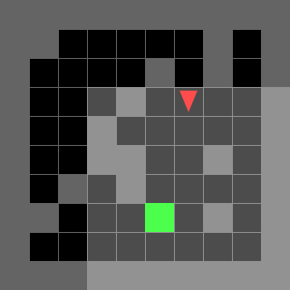
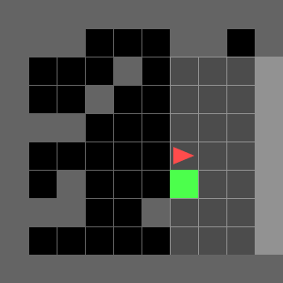
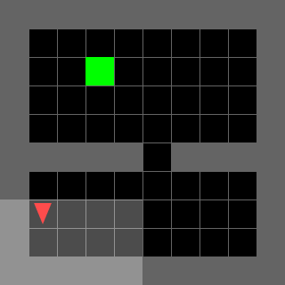
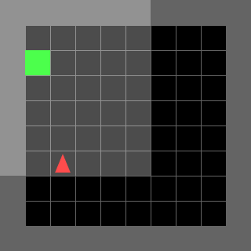
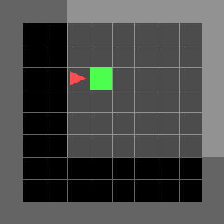
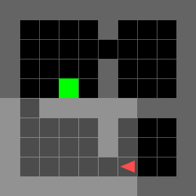
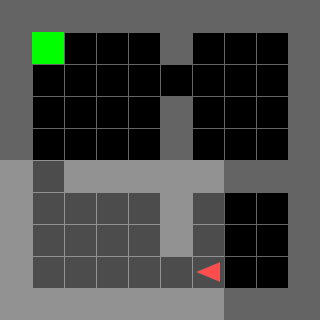
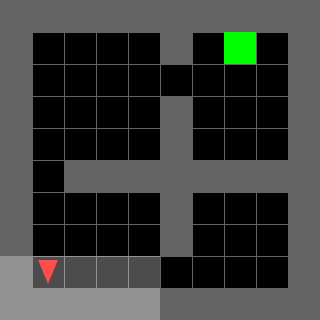
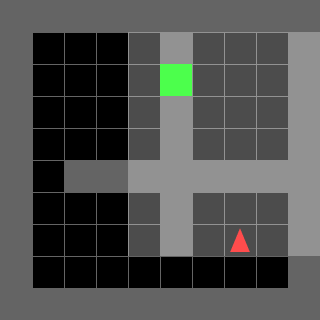

10*10 grid

full observation is given

1. Domain Randomization

Trained for 20M steps

1. 10 Blocks

Mean reward over 100 episodes = 0.8560039062499999 

Solved percentage = 89%

2. 2_rooms

Mean reward over 100 episodes = 0.8495546875

solved percentage = 88%

3. Empty Room (out_of_distribution)

Here the environment without blocks are never seen by the agent, so it can 

be considered as out of distribution test

Mean reward = 0.8433515625 

solved percentage = 87

4. Four Rooms 

Mean reward= 0.712578125 

solved percentage = 74

5. lybarinth

Mean reward = 0
solved percentage = 0

