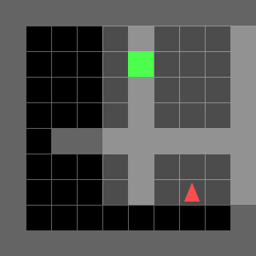

Medium Story: https://medium.com/@dthapa2059/unsupervised-environment-design-60b623cbb41f

# 10x10 Grid

Full observation is given.  

**Training:** Domain Randomization  
**Trained for:** 20M steps  

---

## 1. 10 Blocks
- **Mean reward over 100 episodes:** 0.8560039062499999  
- **Solved percentage:** 89%  

  
  

---

## 2. 2 Rooms
- **Mean reward over 100 episodes:** 0.8495546875  
- **Solved percentage:** 88%  

  
  

---

## 3. Empty Room (Out-of-Distribution)
Here the environment without blocks is never seen by the agent, so it can be considered as an out-of-distribution test.  

- **Mean reward:** 0.8433515625  
- **Solved percentage:** 87%  

  
  

---

## 4. Four Rooms
- **Mean reward:** 0.712578125  
- **Solved percentage:** 74%  

  
  

---

## 5. Labyrinth
- **Mean reward:** 0  
- **Solved percentage:** 0  

